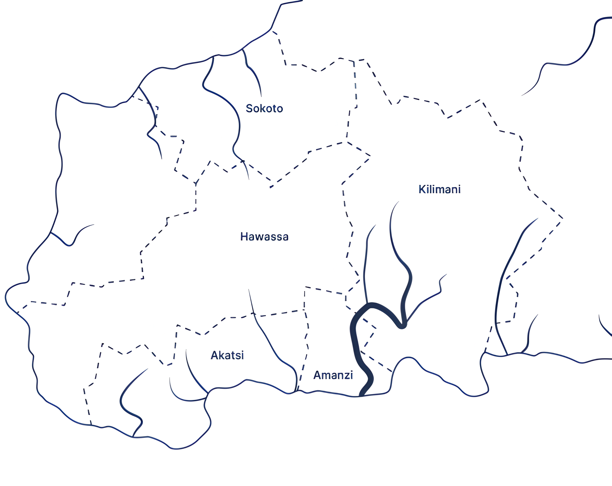

# Maji Ndogo: Unveiling Solutions Through Data

## Introduction

Maji Ndogo, a fictional country, represents communities across the globe facing critical challenges in water access, resource management, and sustainability. Through this data-driven initiative, we delve into the multifaceted issues that impact the daily lives of its inhabitants and explore how data science can empower decision-makers to create lasting solutions.

The project is divided into **two phases**, each focused on solving specific challenges:

1. **Water Access** – A deep dive into Maji Ndogo’s water crisis, leveraging SQL, Power BI, and storytelling to provide insights and solutions.

2. **Farm Survey** *(Coming Soon)* – Exploring agricultural trends and practices to support sustainable development and food security.

## Project Structure

## Phase 1: Water Access Analysis

This phase is split into two key sections:

### 1. [Exploration: Starting the Journey]((./exploration/)

This phase tackles the **water crisis** in Maji Ndogo by analyzing and diving deep into large datasets to uncover actionable insights. Using SQL, we explore data about water sources, community access, and related challenges that highlight the struggles faced by the country's residents. 

- Parts 1–4: Step-by-step SQL exploration, from basic queries to advanced data aggregation techniques.

For more details on this phase, view the [Exploration Project Overview](./exploration/README.md).

### 2: [Visualisation: Our Story Continues](./visualisation/)

Building on the insights from the exploration phase, this section utilizes Power BI to craft interactive reports that communicate findings effectively to key stakeholders. Through this project, we aim to set a high standard for data presentation, ensuring that each insight is accessible and resonant, leading to informed strategies that address water accessibility issues comprehensively.

- Parts 5–8: Focus on storytelling through visual data integration and dashboard creation.

For more details on this phase, view the [Visualisation Project Overview](./visualisation/README.md).

## Phase 2: Farm Survey Analysis *(Coming Soon)*

This phase will explore survey data on farming practices in Maji Ndogo. The analysis will highlight trends in agricultural productivity, resource allocation, and sustainability.

## Vision for the Project

The Maji Ndogo Project is a demonstration of how data science can create meaningful change. From understanding the nuances of community water access to providing tools for better governance, this project exemplifies the power of data in solving real-world problems.

The next phase will explore farm survey analysis, further expanding on how data can drive sustainable solutions for Maji Ndogo's development. *(More details coming soon!)*

## Tools

- **SQL**: For database exploration, analysis, and data manipulation.
- **Power BI**: For creating interactive, visually compelling reports and dashboards.

## Acknowledgments

This project was completed as part of the requirements for the Data Science curriculum at [ALX + Explore AI Academy](https://www.explore.ai/learn/courses/data-science)